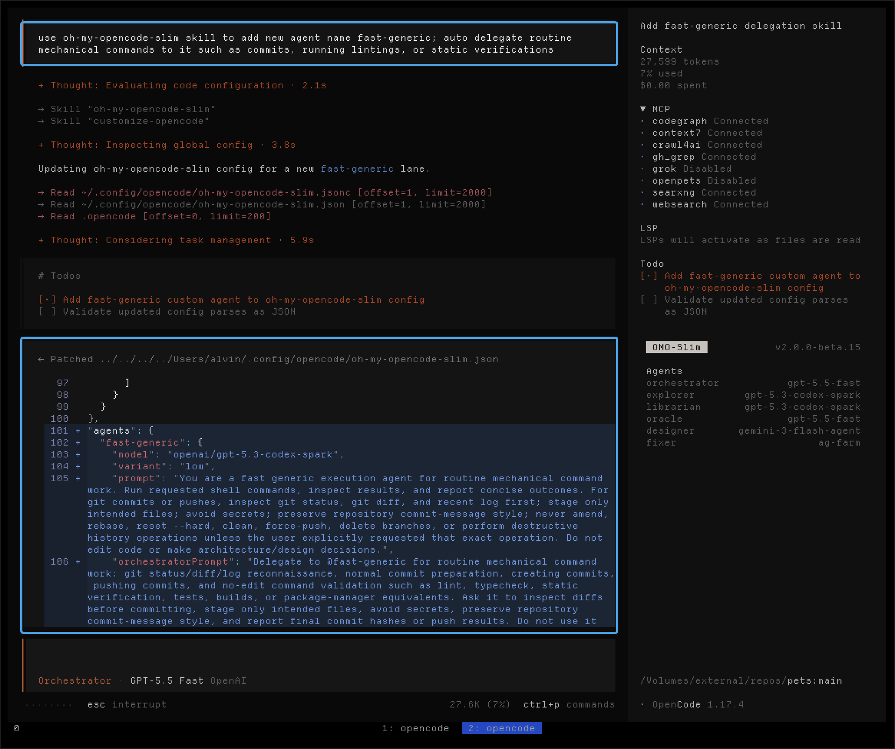
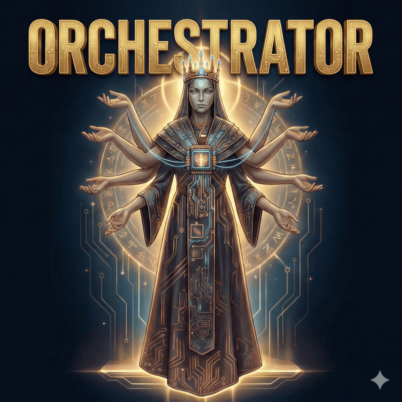

<div align="center">
  <a href="https://github.com/emngny/oh-my-kilocode-slim/stargazers">
    
  </a>
  <h3>✨ oh-my-kilocode-slim ✨</h3>

  <p><i>Seven divine beings emerged from the dawn of code, each an immortal master of their craft,<br>awaiting your command to forge order from chaos and build what was once thought impossible.</i></p>

  <p><b>KiloCode Multi Agent Suite</b> · Mix any models · Auto delegate tasks</p>
  <p><sub>Forked and adapted by <b>emngny</b></sub></p>


  <p><sub>✦ ✦ ✦</sub></p>

</div>

## What's This Plugin

oh-my-kilocode-slim is an agent orchestration plugin for KiloCode. It includes a built-in team of specialized agents that can scout a codebase, look up fresh documentation, review architecture, handle UI work, and execute well-scoped implementation tasks under one chief.

The main idea is simple: instead of forcing one model to do everything, the plugin routes each part of the job to the agent best suited for it, balancing **quality, speed and cost**.

To explore the agents themselves, see **[Meet the Pantheon](#meet-the-pantheon)**. For the full feature set, see **[Features & Workflows](#features-and-workflows)** below.

### What Users Say

> “Task management went from 5/10 to 8-9/10 easily. The Chief sends
> Fixers and Explorers, and I can still talk and plan with the Chief in
> the same session. The experience feels way smoother now.”
>
> \- `vipor_idk`

> “I ditched all my harnesses for this beta version of omo-slim and don't look
> back or miss anything. Great work and IMHO all in the right direction.”
>
> \- `stephanschielke`

> “I love omo-slim, and can't imagine running kilo without it. I love that I
> can create a Frankenstein of models... Makes the setup such a beast.”
>
> \- `Capital-One3039`

> “It has significantly improved my workflow... Now, it is working very
> smoothly, and I love it.”
>
> \- `xenstar1`

### Quick Start

Copy and paste this prompt to your LLM agent (Claude Code, AmpCode, Cursor, etc.):


```
Install and configure oh-my-kilocode-slim: https://raw.githubusercontent.com/emngny/oh-my-kilocode-slim/refs/heads/main/README.md
```


### Manual Installation

```bash
bunx @emngny/oh-my-kilocode-slim@latest install
```

### Run from Master

Use this if you want the latest code, easier bug fixes, or a local setup for
development and contributions:

```bash
git clone https://github.com/emngny/oh-my-kilocode-slim.git ~/repos/oh-my-kilocode-slim
cd ~/repos/oh-my-kilocode-slim
bun install
bun run build
bun dist/cli/index.js install
```

The installer adds the local repo path to the `plugin` array in
`~/.config/kilo/kilo.json`, so KiloCode loads the plugin from that
folder. To update later:

```bash
cd ~/repos/oh-my-kilocode-slim
git pull
bun install
bun run build
```

### Getting Started

The installer generates a clean, empty `custom` preset configuration where you manually define the models you want to use for each agent.

> [!TIP]
> Tune the models and agents for your own workflow. The plugin is designed for deep flexibility and customization, allowing you to use different providers for different agents.

Then:

1. **Log in to the providers you want to use if you haven't already**:

   ```bash
   kilo auth login
   ```
2. **Refresh and list the models KiloCode can see**:

   ```bash
   kilo models --refresh
   ```
3. **Open your plugin config** at `~/.config/kilo/oh-my-kilocode-slim.json`

4. **Update the models you want for each agent** in the `custom` preset configuration.

> [!TIP]
> It's **recommended** to understand how background orchestration works. The **[Chief prompt](https://github.com/emngny/oh-my-kilocode-slim/blob/master/src/agents/chief.ts#L28)** contains the scheduler rules, specialist routing logic, and thresholds for when work should be assigned to background agents. You can always delegate manually by calling a subagent via: `@agentName <task>`

> [!TIP]
> Because background agents are now the default workflow, it is **highly recommended** to enable and configure **[Multiplexer Integration](docs/multiplexer-integration.md)**. It automatically opens each agent in a dedicated Tmux, Zellij, or Herdr pane, so you can watch specialists work live while the Chief continues coordinating the session.

The default generated configuration contains the `custom` preset:

```jsonc
{
  "$schema": "https://unpkg.com/@emngny/oh-my-kilocode-slim@latest/oh-my-kilocode-slim.schema.json",
  "preset": "custom",
  "presets": {
    "custom": {
      "chief": { "model": "", "skills": ["*"], "mcps": ["*", "!context7"] },
      "oracle": { "model": "", "skills": ["simplify"], "mcps": [] },
      "librarian": { "model": "", "skills": [], "mcps": ["websearch", "context7", "gh_grep"] },
      "explorer": { "model": "", "skills": [], "mcps": [] },
      "designer": { "model": "", "skills": [], "mcps": [] },
      "fixer": { "model": "", "skills": [], "mcps": [] },
      "observer": { "model": "", "skills": [], "mcps": [] }
    }
  }
}
```

### For Alternative Providers

To use custom providers or a mixed-provider setup, use **[Configuration](docs/configuration.md)** for the full reference. If you want a ready-made starting point, check the **[Author's Preset](docs/authors-preset.md)** and **[$30 Preset](docs/thirty-dollars-preset.md)** - the `$30` preset is the best cheap setup.

### ✅ Verify Your Setup

After installation and authentication, verify all agents are configured and responding:

```bash
kilo
```

Then run:

```
ping all agents
```

<div align="center">
  
  <p><i>Confirmation that all configured agents are online and ready.</i></p>
</div>

If any agent fails to respond, check your provider authentication and config file.

---

### What's New in V2

V2 turns oh-my-kilocode-slim into a scheduler-first multi-agent workflow system.
The Chief stays focused on planning, delegation, reconciliation, and
verification while specialists do the work in their own lanes.

- **[Background agents](#background-agents)** - the Chief now dispatches
  specialists as background tasks, tracks task/session IDs, waits for completion
  events, and reconciles results before continuing.
- **[Companion](#companion)** - an optional floating desktop window shows which
  agents are currently active, including parallel background specialists.
- **[Deepwork](#deepwork)** - a structured workflow for large, multi-file, risky,
  or phased coding work using persistent plan files and Oracle review gates.
- **[Reflect](#reflect)** - reviews repeated work patterns and suggests reusable skills,
  agents, commands, config rules, prompt rules, or project playbooks.
- **[Worktrees](#worktrees)** - manages Git worktrees as isolated coding lanes
  with safety protocols for complex, risky, or parallel tasks.
- **[oh-my-kilocode-slim skill](#oh-my-kilocode-slim-skill)** - a bundled
  configuration skill that helps tune models, prompts, custom agents, MCP access,
  presets, and plugin behavior safely.

#### Background Agents

V2 makes background specialists the default mental model: the Chief plans
the work graph, launches the right agents, avoids overlapping write ownership,
and waits for terminal task results before acting on them.

See **[Background Orchestration](docs/v2-background-orchestration.md)** for the
full scheduler model.

#### Delegation Mode

V2 lets you tune how aggressively the Chief delegates to specialist agents.
The default is `conservative` — the Chief handles small conversational and
mechanical edits directly, and only delegates when the task clearly needs a
specialist lane. Opt into `aggressive` to have the Chief dispatch almost every
non-trivial task to subagents, since most specialists run on free or cheap
models while the Chief itself is the expensive one.

```json
// ~/.config/kilo/oh-my-kilocode-slim.json
{
  "delegationMode": "aggressive"
}
```

See **[Configuration](docs/configuration.md#delegationmode)** for the full
option reference and trade-offs.

#### Companion

The optional Companion is a floating desktop status window for live agent
activity. It shows the current session state and which agents are active, so
background work is easier to follow at a glance.

<div align="center">
  
  <p><i>Left bottom visual companion.</i></p>
</div>

During interactive install, the installer asks whether to enable Companion and
defaults to `no`. For automation, enable it explicitly with:

```bash
bunx @emngny/oh-my-kilocode-slim@latest install --companion=yes
```

See **[Companion](docs/companion.md)** for configuration, positions, sizes, and
install details.

#### Deepwork

Deepwork is for heavy coding sessions: broad refactors, multi-phase features,
risky architecture changes, or work that needs a persistent plan. It creates a
local markdown progress file, uses Oracle review gates, and keeps implementation
phases structured.

Start it with:

```text
/deepwork <heavy coding task>
```

See **[Skills](docs/skills.md#deepwork)** for when to use it and how the workflow
runs.

#### Reflect

Reflect helps the Chief learn from repeated workflow friction. It reviews
recent work and existing assets, then recommends the smallest useful improvement:
a skill, custom agent, command, config rule, prompt rule, MCP permission change,
or project playbook. If there is not enough evidence, it should recommend
creating nothing.

Use it directly with:

```text
/reflect
/reflect release workflow and checks
```

Or with natural prompts like:

```text
reflect on my recent workflows
find repeated work worth turning into reusable instructions
```

See **[Skills](docs/skills.md#reflect)** for the full workflow and guardrails.

#### Worktrees

Worktrees manages Git worktrees as safe, isolated coding lanes under `.slim/worktrees/<slug>/`. The Chief manages the lifecycle of these lanes, tracks state in `.slim/worktrees.json`, dispatches specialist agents inside them, and requires explicit confirmation before mutating git state.

See **[Skills](docs/skills.md#worktrees)** for the safety protocol.

#### oh-my-kilocode-slim Skill

The bundled `oh-my-kilocode-slim` skill helps the Chief configure and
improve the plugin itself. Use it for model tuning, custom agents, prompt
overrides, skill/MCP permissions, presets, optional agents, background
orchestration, and recurring workflow friction.

<div align="center">
  
  <p><i>Ask the bundled skill to tune and improve your agent setup.</i></p>
</div>

See **[Skills](docs/skills.md#oh-my-kilocode-slim)** for examples and safety
rules.

---

<a id="meet-the-pantheon"></a>

## 🏛️ Meet the Pantheon

### 01. Chief: The Embodiment Of Order

<table>
  <tr>
    <td width="30%" align="center" valign="top">
      
      <br><sub><i>Forged in the void of complexity.</i></sub>
    </td>
    <td width="70%" valign="top">
      The Chief was born when the first codebase collapsed under its own complexity. Neither god nor mortal would claim responsibility - so The Chief emerged from the void, forging order from chaos. It determines the optimal path to any goal, balancing speed, quality, and cost. It guides the team, summoning the right specialist for each task and delegating to achieve the best possible outcome.
    </td>
  </tr>
  <tr>
    <td colspan="2">
      <b>Role:</b> <code>Master delegator and strategic coordinator</code>
    </td>
  </tr>
  <tr>
    <td colspan="2">
      <b>Prompt:</b> <a href="src/agents/chief.ts"><code>chief.ts</code></a>
    </td>
  </tr>
  <tr>
    <td colspan="2">
      <b>Default Model:</b> <code>openai/gpt-5.5 (medium)</code>
    </td>
  </tr>
  <tr>
    <td colspan="2">
      <b>Recommended Models:</b> <code>openai/gpt-5.5 (medium)</code> <code>anthropic/claude-fable-5</code> <code>anthropic/claude-opus-4-8</code>
    </td>
  </tr>
  <tr>
    <td colspan="2">
      <b>Model Guidance:</b> Choose your strongest planning and judgment model. Chief is the workflow manager: it plans, schedules background specialists, reconciles results, and verifies outcomes, so it needs reliable instruction-following and high-level technical judgment more than raw worker throughput.
    </td>
  </tr>
</table>

---

### 02. Explorer: The Eternal Wanderer

<table>
  <tr>
    <td width="30%" align="center" valign="top">
      
      <br><sub><i>The wind that carries knowledge.</i></sub>
    </td>
    <td width="70%" valign="top">
      The Explorer is an immortal wanderer who has traversed the corridors of a million codebases since the dawn of programming. Cursed with the gift of eternal curiosity, they cannot rest until every file is known, every pattern understood, every secret revealed. Legends say they once searched the entire internet in a single heartbeat. They are the wind that carries knowledge, the eyes that see all, the spirit that never sleeps.
    </td>
  </tr>
  <tr>
    <td colspan="2">
      <b>Role:</b> <code>Codebase reconnaissance</code>
    </td>
  </tr>
  <tr>
    <td colspan="2">
      <b>Prompt:</b> <a href="src/agents/explorer.ts"><code>explorer.ts</code></a>
    </td>
  </tr>
  <tr>
    <td colspan="2">
      <b>Default Model:</b> <code>openai/gpt-5.4-mini</code>
    </td>
  </tr>
  <tr>
    <td colspan="2">
      <b>Recommended Models:</b> <code>openai/gpt-5.3-codex</code> <code>cerebras/zai-glm-4.7</code> <code>fireworks-ai/accounts/fireworks/routers/kimi-k2p6-turbo</code>
    </td>
  </tr>
  <tr>
    <td colspan="2">
      <b>Model Guidance:</b> Choose a fast, low-cost model. Explorer handles broad scouting work, so speed and efficiency usually matter more than using your strongest reasoning model.
    </td>
  </tr>
</table>

---

### 03. Oracle: The Guardian of Paths

<table>
  <tr>
    <td width="30%" align="center" valign="top">
      
      <br><sub><i>The voice at the crossroads.</i></sub>
    </td>
    <td width="70%" valign="top">
      The Oracle stands at the crossroads of every architectural decision. They have walked every road, seen every destination, know every trap that lies ahead. When you stand at the precipice of a major refactor, they are the voice that whispers which way leads to ruin and which way leads to glory. They don't choose for you - they illuminate the path so you can choose wisely.
    </td>
  </tr>
  <tr>
    <td colspan="2">
      <b>Role:</b> <code>Strategic advisor and debugger of last resort</code>
    </td>
  </tr>
  <tr>
    <td colspan="2">
      <b>Prompt:</b> <a href="src/agents/oracle.ts"><code>oracle.ts</code></a>
    </td>
  </tr>
  <tr>
    <td colspan="2">
      <b>Default Model:</b> <code>openai/gpt-5.5 (high)</code>
    </td>
  </tr>
  <tr>
    <td colspan="2">
      <b>Recommended Models:</b> <code>openai/gpt-5.5 (xhigh)</code> <code>anthropic/claude-fable-5</code> <code>anthropic/claude-opus-4-8 (xhigh)</code>
    </td>
  </tr>
  <tr>
    <td colspan="2">
      <b>Model Guidance:</b> Choose your strongest high-reasoning model for architecture, hard debugging, trade-offs, and code review.
    </td>
  </tr>
</table>

---

### 04. Council: The Chorus of Minds

> [!NOTE]
> **Why doesn't Chief auto-call Council more often?** This is intentional. Council runs multiple models at once, so automatic delegation is kept strict because it is usually the highest-cost path in the system. In practice, Council is meant to be used manually when you want it, for example: <code>@council compare these two architectures</code>.

<table>
  <tr>
    <td width="30%" align="center" valign="top">
      
      <br><sub><i>Many minds, one verdict.</i></sub>
    </td>
    <td width="70%" valign="top">
      The Council is not a lone being but a chamber of minds summoned when one answer is not enough. It sends your question to multiple models in parallel, gathers their competing judgments, and then the Council agent itself distills the strongest ideas into a single verdict. Where a solitary agent may miss a path, the Council cross-examines possibility itself.
    </td>
  </tr>
  <tr>
    <td colspan="2">
      <b>Role:</b> <code>Multi-LLM consensus and synthesis</code>
    </td>
  </tr>
  <tr>
    <td colspan="2">
      <b>Prompt:</b> <a href="src/agents/council.ts"><code>council.ts</code></a>
    </td>
  </tr>
  <tr>
    <td colspan="2">
      <b>Guide:</b> <a href="docs/council.md"><code>docs/council.md</code></a>
    </td>
  </tr>
  <tr>
    <td colspan="2">
      <b>Default Setup:</b> <code>Config-driven</code> - councillors come from <code>council.presets</code> and the Council agent model comes from your normal <code>council</code> agent config
    </td>
  </tr>
  <tr>
    <td colspan="2">
      <b>Recommended Setup:</b> <code>Strong Council model</code> + <code>diverse councillors</code> across providers
    </td>
  </tr>
  <tr>
    <td colspan="2">
      <b>Model Guidance:</b> Use a strong synthesis model for the Council agent and diverse models as councillors. The value of Council comes from comparing different model perspectives, not just picking the single strongest model everywhere.
    </td>
  </tr>
</table>

---

### 05. Librarian: The Weaver of Knowledge

<table>
  <tr>
    <td width="30%" align="center" valign="top">
      
      <br><sub><i>The weaver of understanding.</i></sub>
    </td>
    <td width="70%" valign="top">
      The Librarian was forged when humanity realized that no single mind could hold all knowledge. They are the weaver who connects disparate threads of information into a tapestry of understanding. They traverse the infinite library of human knowledge, gathering insights from every corner and binding them into answers that transcend mere facts. What they return is not information - it's understanding.
    </td>
  </tr>
  <tr>
    <td colspan="2">
      <b>Role:</b> <code>External knowledge retrieval</code>
    </td>
  </tr>
  <tr>
    <td colspan="2">
      <b>Prompt:</b> <a href="src/agents/librarian.ts"><code>librarian.ts</code></a>
    </td>
  </tr>
  <tr>
    <td colspan="2">
      <b>Default Model:</b> <code>openai/gpt-5.4-mini</code>
    </td>
  </tr>
  <tr>
    <td colspan="2">
      <b>Recommended Models:</b> <code>openai/gpt-5.3-codex</code> <code>cerebras/zai-glm-4.7</code> <code>fireworks-ai/accounts/fireworks/routers/kimi-k2p6-turbo</code>
    </td>
  </tr>
  <tr>
    <td colspan="2">
      <b>Model Guidance:</b> Choose a fast, low-cost model. Librarian handles research and documentation lookups, so speed and efficiency usually matter more than using your strongest reasoning model.
    </td>
  </tr>
</table>

---

### 06. Designer: The Guardian of Aesthetics

<table>
  <tr>
    <td width="30%" align="center" valign="top">
      
      <br><sub><i>Beauty is essential.</i></sub>
    </td>
    <td width="70%" valign="top">
      The Designer is an immortal guardian of beauty in a world that often forgets it matters. They have seen a million interfaces rise and fall, and they remember which ones were remembered and which were forgotten. They carry the sacred duty to ensure that every pixel serves a purpose, every animation tells a story, every interaction delights. Beauty is not optional - it's essential.
    </td>
  </tr>
  <tr>
    <td colspan="2">
      <b>Role:</b> <code>UI/UX implementation and visual excellence</code>
    </td>
  </tr>
  <tr>
    <td colspan="2">
      <b>Prompt:</b> <a href="src/agents/designer.ts"><code>designer.ts</code></a>
    </td>
  </tr>
  <tr>
    <td colspan="2">
      <b>Default Model:</b> <code>openai/gpt-5.4-mini</code>
    </td>
  </tr>
  <tr>
    <td colspan="2">
      <b>Recommended Models:</b> <code>google/gemini-3.5-flash</code> <code>moonshotai/kimi-k2.7-code</code>
    </td>
  </tr>
  <tr>
    <td colspan="2">
      <b>Model Guidance:</b> Choose a model that is strong at UI/UX judgment, frontend implementation, and visual polish.
    </td>
  </tr>
</table>

---

### 07. Fixer: The Last Builder

<table>
  <tr>
    <td width="30%" align="center" valign="top">
      
      <br><sub><i>The final step between vision and reality.</i></sub>
    </td>
    <td width="70%" valign="top">
      The Fixer is the last of a lineage of builders who once constructed the foundations of the digital world. When the age of planning and debating began, they remained - the ones who actually build. They carry the ancient knowledge of how to turn thought into thing, how to transform specification into implementation. They are the final step between vision and reality.
    </td>
  </tr>
  <tr>
    <td colspan="2">
      <b>Role:</b> <code>Fast implementation specialist</code>
    </td>
  </tr>
  <tr>
    <td colspan="2">
      <b>Prompt:</b> <a href="src/agents/fixer.ts"><code>fixer.ts</code></a>
    </td>
  </tr>
  <tr>
    <td colspan="2">
      <b>Default Model:</b> <code>openai/gpt-5.5 (low)</code>
    </td>
  </tr>
  <tr>
    <td colspan="2">
      <b>Recommended Models:</b> <code>openai/gpt-5.5 (low)</code> <code>anthropic/claude-sonnet-4-6</code>
    </td>
  </tr>
  <tr>
    <td colspan="2">
      <b>Model Guidance:</b> Choose a reliable coding model for scoped implementation work. Fixer receives a concrete plan or bounded instructions from Chief, making it a good place for efficient execution tasks and straightforward code changes.
    </td>
  </tr>
</table>

---

## Optional Agents

### Observer: The Silent Witness

> [!NOTE]
> **Why a separate agent?** If your Chief model is not multimodal, enable Observer to handle images, screenshots, PDFs, and other visual files. Observer is disabled by default and gives the Chief a dedicated multimodal reader without forcing you to change your main reasoning model. Set `disabled_agents: []` and an `observer` model in your configuration. The bundled `kilo-go` install preset does this automatically because its GLM Chief is not multimodal.

<table>
  <tr>
    <td width="30%" align="center" valign="top">
      
      <br><sub><i>The eye that reads what others cannot.</i></sub>
    </td>
    <td width="70%" valign="top">

**Read-only visual analysis** - interprets images, screenshots, PDFs, and diagrams. Returns structured observations to the chief without loading raw file bytes into the main context window.

- Images, screenshots, diagrams → `read` tool (native image support)
- PDFs and binary documents → `read` tool (text + structure extraction)
- **Disabled by default** - enable with `"disabled_agents": []` and configure a vision-capable model; installing with `--preset=kilo-go` enables it with `kilo-go/kimi-k2.6`

    </td>
  </tr>
  <tr>
    <td colspan="2">
      <b>Prompt:</b> <a href="src/agents/observer.ts"><code>observer.ts</code></a>
    </td>
  </tr>
  <tr>
    <td colspan="2">
      <b>Default Model:</b> <code>openai/gpt-5.4-mini</code> - <i>configure a vision-capable model to enable</i>
    </td>
  </tr>
  <tr>
    <td colspan="2">
      <b>Model Guidance:</b> Choose a vision-capable model if you want the agent to read screenshots, images, PDFs, and other visual files.
    </td>
  </tr>
</table>

---

## 📚 Documentation

Use this section as a map: start with installation, then jump to features, configuration, or example presets depending on what you need.

<a id="features-and-workflows"></a>

### ✨ Features & Workflows

| Doc | What it covers |
|-----|----------------|
| **[Council](docs/council.md)** | Run multiple models in parallel and synthesize a single answer with `@council` |
| **[Custom Agents](docs/configuration.md#custom-agents)** | Define your own specialists with custom prompts, models, MCP access, and Chief delegation rules |
| **[ACP Agents](docs/acp-agents.md)** | Connect external ACP-compatible agents such as Claude Code ACP or Gemini ACP as delegatable subagents |
| **[Multiplexer Integration](docs/multiplexer-integration.md)** | Watch agents work live in Tmux, Zellij, or Herdr panes |
| **[Codemap](docs/codemap.md)** | Generate hierarchical codemaps to understand large codebases faster |
| **[Clonedeps](docs/clonedeps.md)** | Clone selected dependency source into an ignored local workspace for inspection |
| **[Worktrees](docs/worktrees.md)** | Use `.slim/worktrees/` lanes for isolated parallel or risky coding work |
| **[Preset Switching](docs/preset-switching.md)** | Switch agent model presets at runtime with `/preset` |
| **[Interview](docs/interview.md)** | Turn rough ideas into a structured markdown spec through a browser-based Q&A flow |
| **[Companion](docs/companion.md)** | Floating window companion for parsing, help, and types |

### ⚙️ Config & Reference

| Doc | What it covers |
|-----|----------------|
| **[Installation Guide](docs/installation.md)** | Install the plugin, use CLI flags, reset config, and troubleshoot setup |
| **[Configuration](docs/configuration.md)** | Config file locations, JSONC support, prompt overrides, and full option reference |
| **[Project Customization](docs/project-local-customization.md)** | Repository-specific custom agents, prompt overrides, per-agent skills, and precedence |
| **[Background Orchestration](docs/background-orchestration.md)** | Scheduler-first chief model built around native background subagents |
| **[Maintainer Guide](docs/maintainers.md)** | Issue triage rules, label meanings, support routing, and repo maintenance workflow |
| **[Skills](docs/skills.md)** | Bundled skills such as `simplify`, `codemap`, `clonedeps`, `deepwork`, `reflect`, `worktrees`, and `oh-my-kilocode-slim` |
| **[MCPs](docs/mcps.md)** | `websearch`, `context7`, `gh_grep`, and how MCP permissions work per agent |
| **[Tools](docs/tools.md)** | Built-in tool capabilities like `webfetch`, LSP tools, code search, and formatters |

### 💡 Presets

| Doc | What it covers |
|-----|----------------|
| **[Author's Preset](docs/authors-preset.md)** | The author's daily mixed-provider setup |
| **[$30 Preset](docs/thirty-dollars-preset.md)** | A budget mixed-provider setup for around $30/month |
| **[KiloCode Go Preset](docs/kilo-go-preset.md)** | The bundled `kilo-go` preset generated by the installer |

---

## 📄 License

MIT

---
